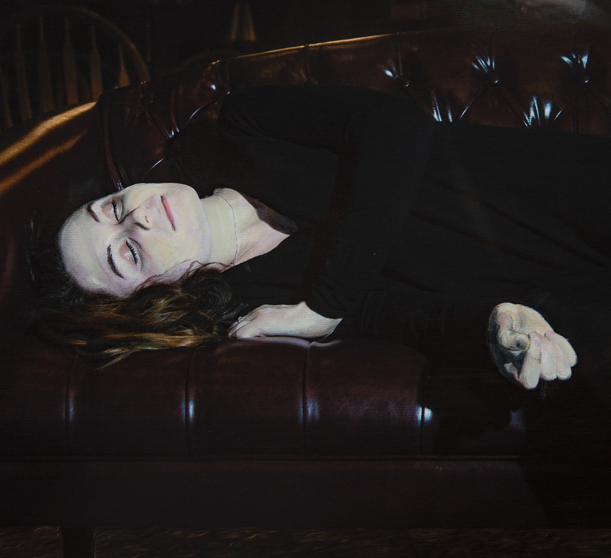

<!---
INSTRUCTIONS: Fill in the Frontmatter (above) with the artist's relevant information.
Then copy in their artist's statment and images. Put a '###' in front of a line for big text, as demonstrated below.
For full width images, make sure you put each one inside its own set of Div tags (also shown below).
Re-order text and image below this comment however you want it to appear on the actual site
(do not change the placement of the Frontmatter!)
The Description is for SEO, so what shows up on and will inform Google Search results. Keep it short!
-->

_If so be that ye have heard him, and have been taught by him, as the truth is in Jesus: That ye have put off concerning the **old man**, which is corrupt according to the deceitful lusts; Being renewed in the spirit of your mind; And that ye have put on the **new man**, which after God is created in righteousness and true holiness._ – Ephesians 6:21-24

This cornerstone belief highlights a fundamental aspect of Christian life. The old, temporal self must be cast off in order to fully embrace the new self that is born into Christ. This work shares my experience with the faith at Kenyon College through the form of a parable, a common Biblical teaching method, which can offer its lesson to anyone due to a nonspecific historical context. Across five images this woman experiences the struggle of letting the old self go. By the last scene, she perseveres to be able to drink the waters of life freely. In form, the stylistic influences reflect my transition from a Western form of Christianity into Eastern Orthodoxy, where the spiritual implications of art generally take precedence. The use of traditional oil paint over a digital photographic print builds another layer upon the conceptual base of old versus new. Through manually and digitally altered images I build a narrative that has the ability for those within the faith to reflect and those outside the faith to have a less intimidating glance into what that faith offers.

